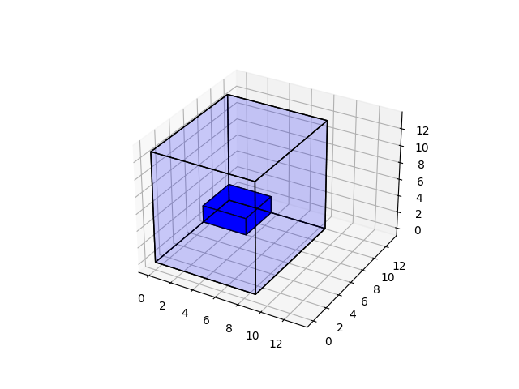

## About

This is an OpenAI gym environment for the 3D Bin Packing game.



The game is like "3D tetris": to pack coming boxes to a container as space efficient as possible.

Game rules:
- You see 1 or more up coming boxes.
- You choose a x,y position and rotation of the box
- You place the box into the container and get reward.
- The space to place the box should be accesable from the top, and the box should be physically stable after the placement
- The game ends when you make an invalid placement, either because you hit the top (like tetris) or your placement is unstable.

This "game" is commonly played in logistic, eg packing trucks with items from conveyer belt.

Code refactored from https://github.com/alexfrom0815/Online-3D-BPP-DRL

The "CUT-1", "CUT-2" box seuence generator, and the box stability judgement follows rules as specified in Ref[1]

## Reference
1. 

2. https://github.com/alexfrom0815/Online-3D-BPP-DRL  (Repo of 1)

2. https://github.com/openai/gym/blob/master/docs/creating-environments.md


## Install
```
git clone https://github.com/ylchan87/gym-BinPack3D.git
cd gym-BinPack3D
pip install -e .
```

## Doc

See `doc/MinimalExample.ipynb` for example usage

See func `step` in `gym_BinPack3D/envs/BinPack3DEnv.py` to customize the reward.

See func `check_box_placement_valid` in `gym_BinPack3D/envs/Container.py` to customize the box stability check.

